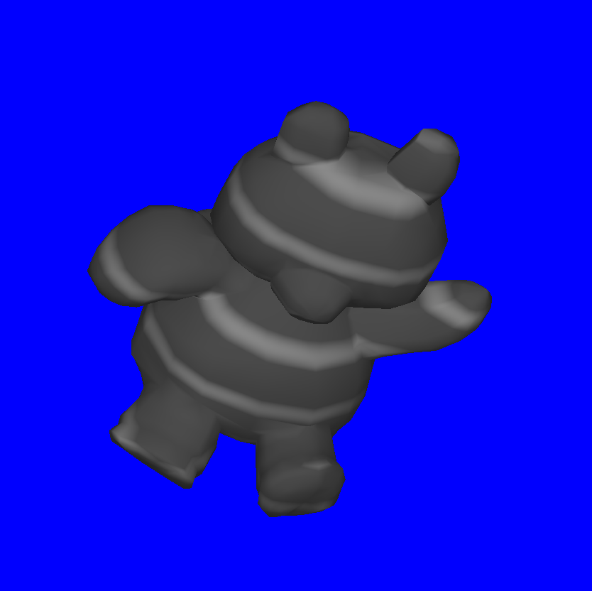

# cs4850-lab-rendering

## Instructions

In this lab you'll implement rendering functionality for the OpenGL API.

You are provided with a basic program that displays a model using a mesh, vertex shader, and fragment shader.  But, there are a few pieces of functionality to be added!

When you're done, It should look something like this:

### Part 1 - Spinning

The mesh is currently sitting still.  Add some code to `SDLGraphicsProgram::render` make the mesh spin around its center.

### Part 2 - Vertex Normals

The mesh is not lit, since there are no vertex normals (they are all 0).  Update the code in `estimateNormals` to  estimate the normals for each vertex. Your math library may come in handy!

Resources
- [How to compute mesh normals](https://mrl.nyu.edu/~perlin/courses/fall2002/meshnormals.html)

### Part 3 - Shader Pattern

The model looks fairly plain.  Update `vertex.glsl` and `fragment.glsl` to add a procedural pattern to the **diffuse color** of the model.  In particular, the patern should be handled in the **local space** of the model - that is, it should appear to move with the model as it spins.  You'll likely need to add a new varying variable to the shaders to keep track of local space coordinates.

Resources
- [Hello World in GLSL](https://www.lighthouse3d.com/tutorials/glsl-12-tutorial/hello-world-in-glsl/)
- [Directional Light per Pixel](https://www.lighthouse3d.com/tutorials/glsl-12-tutorial/directional-light-per-pixel/)

### Part 4 - Extensions (CS5850 only)

Choose and implement **at least one** of the following extensions (you can do more if you like):
- Allow use of arrow keys to translate the model (using `glTranslate`).
- Update lighting so a red, green, or blue speculiar highlight appears on the model (you'll likely need to call `glMaterial`).
- Update lighting in the fragment shader to change the light to a point light or spotlight.
- Add a texture from an image file to the model.
- Write an asset conditioning program (in whatever language you like) to convert the provided obj file into a format that can be read directly into memory (e.g. using `fread`). Add the program and the conditioned mesh to repo.
- (If you have an idea for another extension check with me before implementing it.)

### Part 5 - Meta

Fill out `meta.txt` with your answers to the questions about the assignment in the file (including the extension(s) you implemented).

## Miscellaneous Resources
- [OpenGL: Setting Up SDL 2](https://www.turbonut.com/2019/03/18/opengl3-sdl2/)

## Rubric

1 pt: Part 1 spinning complete

4/3 pt: Part 2 all / some vertex normals complete

3/2 pt: Part 3 all / some shader pattern complete

1 pt: Part 4 extension complete **(CS5850 only)**

2 pt: Part 5 meta answers complete

+0.5 pt: implementing one additional extension beyond requirements

~~-X: general assignment guidelines~~
